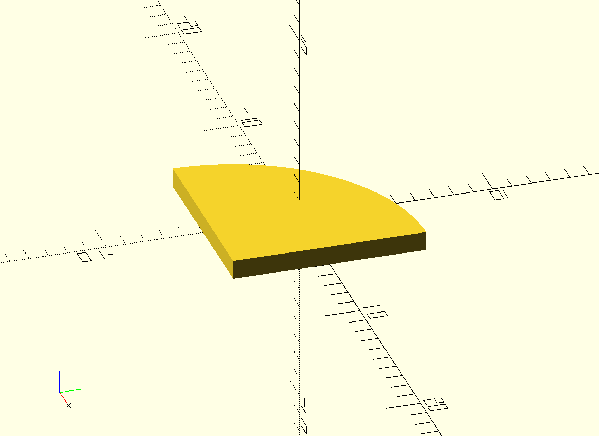
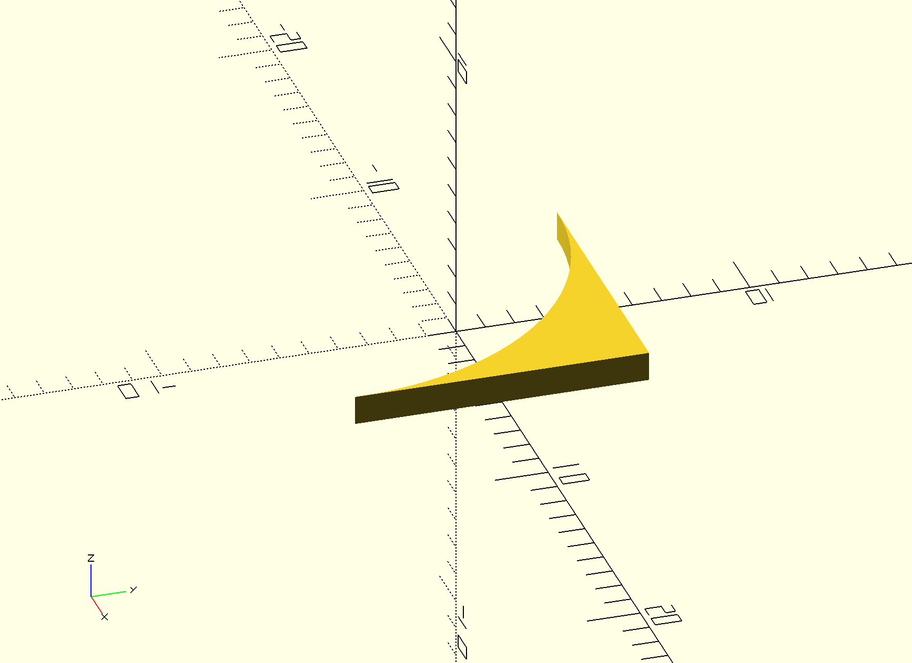

# OpenSCAD Quarter Circle/Torus

This repository hosts an OpenSCAD script with a couple of modules for drawing
quarter circles and tori.

The recommended installation method is to add this repository as a submodule in
your repository and pull in the script with this line:

```openscad
use <openscad-quarter-circle-torus/quarter-circle-torus.scad>
```

The documentation for the available modules follows.

## `quarter_circle`

Parameters:
- `side`: the side of the enclosing square (default `10`)
- `quadrant`: the quadrant of the circle to draw (default `0`)
  - `0`: top left quarter circle
  - `1`: bottom left quarter circle
  - `2`: bottom right quarter circle
  - `3`: top right quarter circle
- `$fn` (facet number): built-in OpenSCAD variable for smoothing the round edge

```openscad
linear_extrude(height = 1)
quarter_circle(quadrant = 0, $fn = 100);
```


```openscad
linear_extrude(height = 1)
quarter_circle(quadrant = 1, $fn = 100);
```


```openscad
linear_extrude(height = 1)
quarter_circle(quadrant = 2, $fn = 100);
```


```openscad
linear_extrude(height = 1)
quarter_circle(quadrant = 3, $fn = 100);
```



## `inverted_quarter_circle`

Parameters:
- `side`: the side of the enclosing square (default `10`)
- `quadrant`: the inverted quarter of the circle to draw (default `0`)
  - `0`: top left inverted quarter circle
  - `1`: bottom left inverted quarter circle
  - `2`: bottom right inverted quarter circle
  - `3`: top right inverted quarter circle
- `$fn` (facet number): built-in OpenSCAD variable for smoothing the round edge

```openscad
linear_extrude(height = 1)
inverted_quarter_circle(quadrant = 0, $fn = 100);
```


```openscad
linear_extrude(height = 1)
inverted_quarter_circle(quadrant = 1, $fn = 100);
```


```openscad
linear_extrude(height = 1)
inverted_quarter_circle(quadrant = 2, $fn = 100);
```



```openscad
linear_extrude(height = 1)
inverted_quarter_circle(quadrant = 3, $fn = 100);
```


## `quarter_torus`

Parameters:
- `angle`: the extrusion angle (0-360)
- `radius`: the radius of the torus hole
- `side`: the bounding square side of the looped quarter circle making the torus
  (default `10`)
- `quadrant`: the orientation and type of the slope of the hole (0-3, difficult
  to explain - just try it)
- `$fn` (facet number): built-in OpenSCAD variable for smoothing the round edge

```openscad
quarter_torus(quadrant = 0, $fn = 100);
```


```openscad
quarter_torus(quadrant = 1, $fn = 100);
```


```openscad
quarter_torus(quadrant = 2, $fn = 100);
```


```openscad
quarter_torus(quadrant = 3, $fn = 100);
```


## `inverted_quarter_torus`

Parameters:
- `angle`: the extrusion angle (0-360)
- `radius`: the radius of the inverted torus hole
- `side`: the bounding square side of the looped inverted quarter circle making
  the torus (default `10`)
- `quadrant`: the orientation and type of the slope of the hole (0-3, difficult
  to explain - just try it)
- `$fn` (facet number): built-in OpenSCAD variable for smoothing the round edge

```openscad
inverted_quarter_torus(quadrant = 0, $fn = 100);
```


```openscad
inverted_quarter_torus(quadrant = 1, $fn = 100);
```


```openscad
inverted_quarter_torus(quadrant = 2, $fn = 100);
```


```openscad
inverted_quarter_torus(quadrant = 3, $fn = 100);
```


